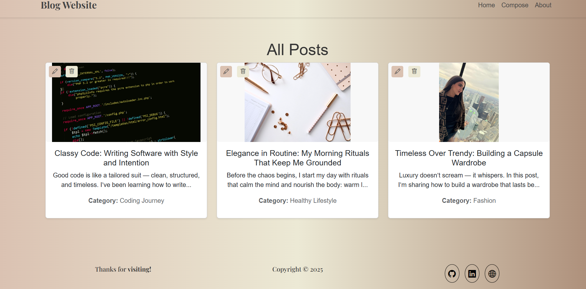

# 📝 Blog Website — by Kawther Khlif

A fully functional and elegant blog platform built with **Node.js**, **Express**, **MySQL**, and **EJS**. This project allows users to create, edit, delete, and view blog posts — all within a responsive layout inspired by a refined, timeless design aesthetic.

---

## ✨ Features

- 🖋️ **Create Posts**: Add a blog post with title, content, category, and image.
- 🛠️ **Edit Posts**: Update existing posts with a clean, pre-filled form.
- 🗑️ **Delete Posts**: One-click deletion, including associated image removal.
- 🖼️ **Image Uploads**: Upload validated images (type + size).
- 📱 **Responsive Design**: Fully functional on desktop and mobile.
- 🎨 **Thematic Styling**: Soft tones, round cards, clean fonts, and hover effects.

---
## 📸 Screenshots

| Home Page | Create Post | Edit Post |
|-----------|-------------|-----------|
|  |  |  |

---

## 🔧 Technologies Used

### 📦 Backend
- [Node.js](https://nodejs.org/)
- [Express.js](https://expressjs.com/)
- [MySQL](https://www.mysql.com/)

### 💻 Frontend
- [EJS](https://ejs.co/) (Embedded JavaScript Templates)
- [Bootstrap 5](https://getbootstrap.com/) for layout & components
- [Bootstrap Icons](https://icons.getbootstrap.com/)
- [Google Fonts – Playfair Display](https://fonts.google.com/specimen/Playfair+Display)
- Custom CSS (for classy look and responsiveness)

### 📁 File Uploads
- [Multer](https://github.com/expressjs/multer) – image upload handling

---

## 🚀 Getting Started

### 📋 Prerequisites
- Node.js
- MySQL
- Git

### 🔧 Installation

1. **Clone the Repository**
   ```bash
   git clone https://github.com/kawtherkhlif/blog-website.git
   cd blog-website
2. **Install Dependencies**
   ```bash
   npm install
3. **Create the MySQL Database**
   ```sql
   CREATE DATABASE blog_website;

    CREATE TABLE posts (
    id INT AUTO_INCREMENT PRIMARY KEY,
    title VARCHAR(255) NOT NULL,
    content TEXT NOT NULL,
    category VARCHAR(100) NOT NULL,
    image VARCHAR(255) NOT NULL
     );
4. **Configure Database Connection**

In app.js, update your MySQL connection:
      ```js
       const db = mysql.createConnection({
       host: "localhost",
      user: "your_username",
      password: "your_password",
      database: "blog_website"
      });
5. Run the App
   ```bash
      node app.js
6. **Open your browser at**
     http://localhost:3000

📁 Project Structure
```
Blog-Website/
├── public/
│ ├── main.css # Custom styling
│ └── uploads/ # Uploaded post images
├── views/
│ ├── home.ejs # Home page layout
│ ├── compose.ejs # Create post page
│ ├── edit.ejs # Edit post page
│ └── partials/
│ ├── header.ejs
│ └── footer.ejs
├── app.js # Main server file
├── package.json # Project metadata
└── README.md
```

💡 Features in Detail
🏠 Home Page
Grid display of all blog posts

Each post shows:

Title

Short content preview

Category

Featured image

Edit + Delete buttons

📝 Create Post
Form with:

Title input

Content area

Category dropdown

Image upload

✏️ Edit Post
Pre-filled form with current post data

Option to update text and image

Replaces previous image on update

🗑️ Delete Post
One-click delete

Automatically removes associated image from /uploads/

🎨 Design & Styling
Neutral color palette: #DAC1B1, #ECE9D5, soft grey accents

Buttons with subtle gradients and hover effects

Fonts: Playfair Display for elegance and readability

Responsive layout using Bootstrap grid system

Image cards sized uniformly for harmony

🔮 Future Enhancements
🔐 User Authentication (login, register, secure post control)

🔍 Search & Filter posts by category or keywords

📄 Pagination for post lists

🧾 Rich Text Editor for enhanced post formatting

💬 Comment system for post interaction

🙋 About Me
Kawther Khlif
🧑‍💻 Software Developer | UI & UX Enthusiast
🌐 Portfolio Website
💼 LinkedIn
🐙 GitHub

📜 License
This project is licensed under the MIT License.
Feel free to fork, modify, and build on it.

🙏 Acknowledgements
Bootstrap — layout & components

Multer — file uploads

EJS — powerful templating

Fonts from Google Fonts
"""